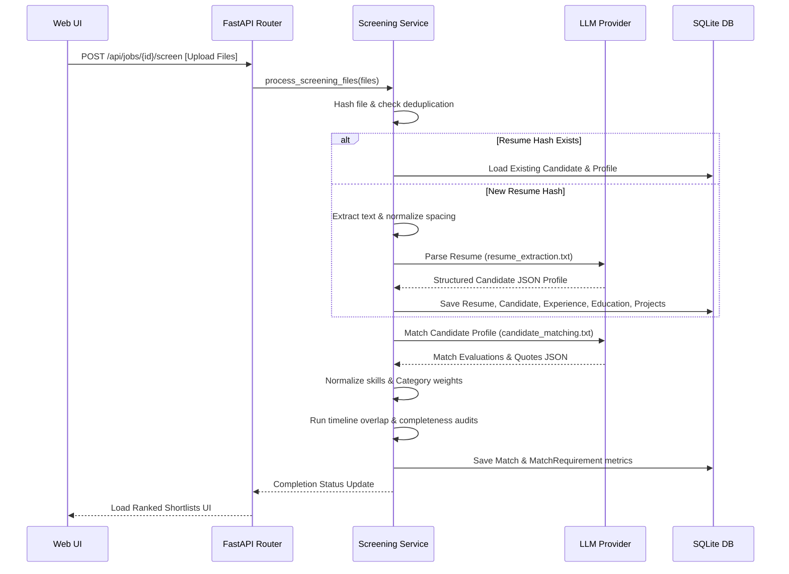
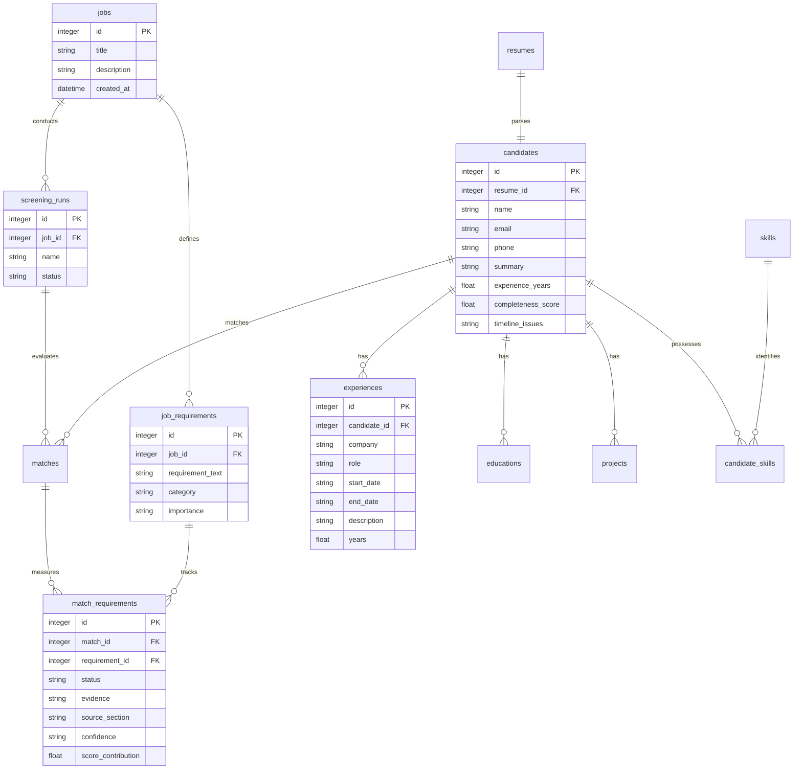

# Resume Screener — Explainable Candidate Intelligence Platform

TalentLens AI is an evidence-backed, production-grade candidate matching and recruiter decision-support system. It transforms unstructured resumes and job descriptions into structured requirements and provides deterministically calculated, explainable suitability ratings.

Unlike basic AI screeners that output arbitrary percentage match scores with no trace, TalentLens AI traces every AI claim to direct quotes from the resume, highlights skill gaps, checks for timeline conflicts, and simulates score sensitivity.

---

## 1. Problem Statement
Traditional Applicant Tracking Systems (ATS) and modern AI screeners suffer from major flaws:
1. **Keyword Stuffing & False Negatives**: Keyword-based search filters reject qualified candidates who use synonyms (e.g. writing "Postgres" instead of "PostgreSQL") or who describe experiences conceptually without mentioning specific buzzwords.
2. **Opaque Black-Box Scoring**: Many AI screeners ask LLMs to output arbitrary suitability scores (e.g., "Match: 85%"). These scores are non-reproducible, prone to hallucination, and impossible to audit.
3. **Algorithmic Bias**: Unmitigated screening pipelines replicate human biases by considering photos, names, gender, graduation years, or locations.
4. **Lack of Trust**: Recruiters cannot verify AI recommendations without manually reviewing the raw resume text, defeating the purpose of automation.

## 2. Solution
TalentLens AI addresses these limitations through a hybrid architecture:
1. **Semantic Extraction**: The LLM parses unstructured text into structured candidate and job profiles, normalizing variations to canonical names.
2. **Deterministic Scoring**: Numerical scores are calculated in application code using configurable, transparent formulas.
3. **Traceable Evidence Mapping**: The matching engine associates all status ratings with direct, quoted text segments from the resume, showing the recruiter exactly where the claim was found.
4. **Timeline & Completeness Audits**: Scans date sequences for concurrent jobs or degree programs, raising non-judgmental warnings for recruiter inspection.

## 3. Key Differentiators
* **Bidirectional Evidence Mapping**: Every match is backed by a direct quote and location mapping (e.g. `Projects -> Task Tracker`).
* **Deterministic Rules Engine**: Weights and calculations are handled in code, making results 100% reproducible and adjustable without altering prompts.
* **Timeline Overlap Detection**: Deterministic date checkers identify concurrent employment overlaps beyond a 1-month transition grace period.
* **Decision Sensitivity Matrix**: Shows recruiters the potential score impact if missing critical skills are verified (e.g. `AWS verified: +8 pts`).
* **Blind Match Architecture**: Ignored personal details in prompt matching to prevent demographic, age, or location bias.

---

## 4. Features
* **Job Requirements Parser**: Converts raw job descriptions into structured requirement profiles grouped by importance and category.
* **Batch Ingestion Pipeline**: Handles drag-and-drop uploads of multiple resumes, displaying real-time stage progress loaders.
* **Rich Candidate Directory**: Renders ranked directory lists complete with match recommendations, completeness scores, and timeline warning alerts.
* **Gantt Experience Timeline**: Builds interactive CSS experience blocks showcasing work histories.
* **Candidate Comparison Matrix**: Generates side-by-side matrices comparing fits, recommendations, experience years, and technological statuses.
* **Offline Mock Mode**: Runs fully offline with zero API cost, generating high-fidelity candidates for demonstrations.

---

## 5. System Architecture & Data Flow

### Architectural Component Diagram
```
            ┌─────────────────────┐
            │    HTML / JS SPA    │ (Vanilla Web UI)
            └──────────┬──────────┘
                       │ Fetch API
                       ▼
            ┌─────────────────────┐
            │   FastAPI Backend   │ (REST Route Controllers)
            └──────────┬──────────┘
                       │
         ┌─────────────┼──────────────┐
         ▼             ▼              ▼
   Document Svc     Job Svc     Screening Run Svc
         │             │              │
   PDF Extractor   JD Parser    Matching Engine
         │             │              │
         └─────────────┼──────────────┘
                       ▼
                Evidence Engine
                       │
                       ▼
                Scoring Engine
                       │
                       ▼
             SQLAlchemy / SQLite
```

### Data Flow Diagram


---

## 6. Database Schema
We employ a properly normalized database schema using SQLAlchemy to represent candidate profiles, timeline structures, job requirements, and matches:



---

## 7. API Documentation

### Job Endpoints
* **`POST /api/jobs`**: Create a job profile. If requirements list is omitted, the LLM parses the description to auto-generate structured criteria.
  - *Request Payload*:
    ```json
    {
      "title": "Backend Architect",
      "description": "Looking for Python and FastAPI developers...",
      "department": "Engineering"
    }
    ```
* **`GET /api/jobs`**: List all registered job roles.
* **`GET /api/jobs/{id}`**: Fetch details and requirements of a specific job role.

### Screening Endpoints
* **`POST /api/jobs/{id}/screen`**: Screen multiple resumes against a job.
  - *Payload*: `multipart/form-data` containing files.
  - *Response*: Returns the `ScreeningRun` metadata showing status `processing` while background threads parse the files.
* **`GET /api/screening-runs/{id}`**: Monitor screening run completion status.

### Candidate & Match Endpoints
* **`GET /api/candidates/{id}`**: Retrieve candidate contact info, experiences timeline, education, and skills.
* **`GET /api/matches/{id}`**: Fetch score breakdowns, recommendation status, and requirement matrices.
* **`GET /api/matches/{id}/sensitivity`**: Get simulated score changes for missing critical criteria.
* **`POST /api/candidates/compare`**: Side-by-side comparison matrix.
  - *Payload*: `{"candidate_ids": [1, 2, 3]}`.

---

## 8. LLM Architecture & Prompt Engineering
The LLM serves as a structured text processor. We separate prompts from application logic inside version-controlled text files:

1. **`resume_extraction.txt`**: Extracts resume components into a strict JSON schema. Force-standardizes employment dates to `YYYY-MM` or `Present` and calculates individual role durations.
2. **`job_analysis.txt`**: Isolates technical, educational, and experience criteria from raw JD text, classifying priorities as `CRITICAL`, `HIGH`, `MEDIUM`, or `LOW`.
3. **`candidate_matching.txt`**: Evaluates candidates against specific requirements. Forbids the model from calculating numerical match scores. Instructs the model to output a strict JSON payload mapping status (`MATCH`, `PARTIAL`, `MISSING`, `UNKNOWN`), confidence ratings, and exact resume quote strings.

*Anti-Hallucination Constraints*: Prompts explicitly instruct the LLM to write "No evidence found" for skills or certifications that are not explicitly stated, preventing inference fabrication.

---

## 9. Scoring Methodology
Suits scores are calculated deterministically on the server:
$$\text{Score} = w_{\text{tech}} S_{\text{tech}} + w_{\text{exp}} S_{\text{exp}} + w_{\text{proj}} S_{\text{proj}} + w_{\text{edu}} S_{\text{edu}} + w_{\text{other}} S_{\text{other}}$$

### Configurable Dimension Weights (Default)
1. **Technical Skills Alignment ($S_{\text{tech}}$)**: 40%
2. **Relevant Experience ($S_{\text{exp}}$)**: 30%
3. **Projects / Technical Evidence ($S_{\text{proj}}$)**: 15%
4. **Education ($S_{\text{edu}}$)**: 10%
5. **Other Relevant Factors ($S_{\text{other}}$)**: 5%

### Technical Score Calculation
For all technical requirements $R_{\text{tech}}$, each has importance $I_r$ and candidate status value $M_r$:
* **Importance Weight ($I_r$)**: `CRITICAL` = 1.0, `HIGH` = 0.8, `MEDIUM` = 0.5, `LOW` = 0.2
* **Match Status ($M_r$)**: `MATCH` = 1.0, `PARTIAL` = 0.5, `MISSING` = 0.0, `UNKNOWN` = 0.0

$$S_{\text{tech}} = \frac{\sum_{r \in R_{\text{tech}}} I_r \times M_r}{\sum_{r \in R_{\text{tech}}} I_r} \times 100$$

### Experience Score Calculation
Compares required experience years $Y_{\text{req}}$ (parsed from description text) against total candidate years $Y_{\text{cand}}$:
- If $Y_{\text{cand}} \ge Y_{\text{req}}$: $S_{\text{exp}} = 100\%$
- If $Y_{\text{cand}} < Y_{\text{req}}$: $S_{\text{exp}} = \frac{Y_{\text{cand}}}{Y_{\text{req}}} \times 100\%$

---

## 10. Evidence Model
The **Evidence Engine** binds matches, partial matches, and gaps to specific contexts:
* **Status `MATCH`**: Supported by explicit direct quote and location mapping.
* **Status `PARTIAL`**: Indicated when the candidate has exposure but lacks core parameters (e.g., docker mentioned in a project description but missing from work history).
* **Status `MISSING`**: Flags a gap in the candidate's background. Prompts output "No evidence found" for clear tracking.
* **Status `UNKNOWN`**: Used when text description lacks contextual indicators to evaluate.

---

## 11. Fairness, Privacy, and Security Controls

### Fairness Controls
* **Blind Match Processing**: Prompt boundaries omit candidate name, email, and phone during requirement matching.
* **Irrelevant Metrics Ignored**: Instructions forbid the LLM from considering demographic identifiers, including photographs, gender, age, race, ethnicity, or nationality.

### Privacy Considerations
* **Local Ingestion**: The backend utilizes a local SQLite instance, ensuring no candidate profiles or contact details are stored on public cloud database instances.
* **No Public Scraping**: The parser only processes submitted PDF or TXT files, preventing unauthorized digital footprint tracking.

### Security Protections
* **Upload File Size Validation**: Limits file uploads to a maximum of 5MB per file to prevent Denial of Service (DoS) memory overload attacks.
* **No File Executions**: The document parser strictly extracts text using library readers (`pypdf`), completely bypassing potential script injection vectors.

---

## 12. Testing & Verification

We enforce pipeline checks via Pytest:
* **`test_text_normalization`**: Spacing cleanups.
* **`test_completeness_calculation`**: Verification of profile completeness logic.
* **`test_skill_normalization`**: Alias-to-technology category mappings.
* **`test_timeline_overlap_checks`**: Identifying date conflict warnings.
* **`test_api_health`** & **`test_api_job_creation`**: REST endpoints integration checks.

Run tests:
```bash
python -m pytest backend/tests/
```

---

## 13. Setup & Running Locally

### Prerequisites
* Python 3.12+ installed.

### Installation
1. Navigate to the project root:
   ```bash
   cd C:\Users\abrah\.gemini\antigravity\scratch\talentlens-ai
   ```
2. Create and activate a Virtual Environment:
   ```bash
   python -m venv .venv
   .venv\Scripts\activate
   ```
3. Install dependencies:
   ```bash
   pip install -r backend/requirements.txt
   pip install httpx
   ```
4. Start the Application:
   ```bash
   $env:PYTHONPATH="backend"
   python backend/app/main.py
   ```
5. Open browser:
   Navigate to **[http://localhost:8000](http://localhost:8000)**.

---

## 14. Docker Deployment

Build and run the entire application container:
```bash
docker-compose up --build
```
Access the application on [http://localhost:8000](http://localhost:8000).

---

## 15. Demo Instructions & Known Limitations

### Demo Walkthrough
1. Access the web interface on port 8000.
2. Click the **`⚡ Run 2-Minute Demo Run`** button.
3. The platform creates a job description, uploads 5 candidate resumes, and evaluates fits instantly in mock mode.
4. Review the candidate directory, click **Inspect** on any card, verify the overlap warning labels on Alice White, and verify the side-by-side matrices.

### Known Limitations & Future Improvements
1. **OCR Support**: Scanned PDFs (lacking embedded text layers) are currently skipped. *Future improvement*: Integrate `pytesseract` to handle scanned images.
2. **Dynamic Weights**: Scoring weights are system-wide in configuration. *Future improvement*: Support adjustments of scoring weights on a per-job basis directly in the UI.

---

## 16. Interview Questions
See [INTERVIEW.md](file:///C:/Users/abrah/.gemini/antigravity/scratch/talentlens-ai/INTERVIEW.md) in the project root for answers regarding:
* Scale-out designs to 100,000 resumes.
* Cost reduction and API token optimization methods.
* Details on timeline overlaps and bias protections.
