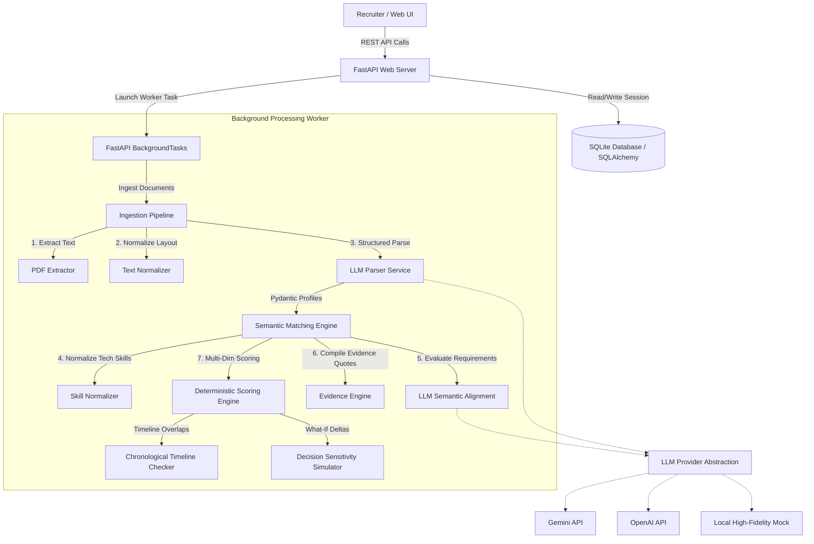

# TalentLens AI - System Architecture

TalentLens AI is designed with a decoupled, clean architecture to ensure maintainability, testing isolation, and clear separation of concerns between AI heuristics and deterministic calculations.

## 1. Component Interaction Model

## 2. Core Architectural Decisions

### Separation of AI and Application Logic
Many AI applications let the LLM invent candidate scores (e.g. *"Rate this candidate from 1 to 100"*). This yields non-reproducible, biased, and unexplainable results.
TalentLens AI enforces strict separation:
1. **The LLM is a semantic classifier**: It extracts text, determines whether a structured candidate profile matches a specific requirement text, and quotes the direct evidence from the resume.
2. **The Application is the scoring authority**: A deterministic mathematical engine applies configured importance weights, computes year gaps, and checks timeline anomalies, yielding consistent, explainable results.

### Ingestion Performance & Deduplication
To reduce API costs and response times, the ingestion pipeline hashes the contents of incoming files. If a recruiter uploads a resume that has already been screened, the system retrieves the raw text and structured candidate profile from the database directly, executing the matching engine without invoking external LLM extraction.

### Database Design
The schema is normalized to map the logical components of a candidate's background:
- A `Candidate` has many `Experience` timeline items, `Education` records, `Project` items, and normalized `Skill` references.
- This clean separation allows the SQL schema to be easily queried for comparisons and gap analysis, avoiding giant unstructured JSON blobs in candidate profiles.
- Although configured for SQLite locally, SQLAlchemy handles the dialect mapping so migrating to PostgreSQL only requires changing the `DATABASE_URL` environment variable.
